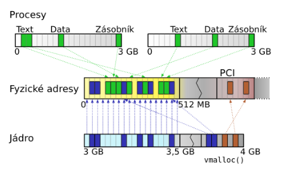

# Operační systémy
Vypracoval @simonf-dev
> Operační systém UNIX, fungování jádra, správa paměti a zařízení jádrem. Základní konfigurace, správa uživatelů, síťové služby. Principy vývoje a vývojové prostředí v UNIXu, práce s procesy, se soubory, vstupní/výstupní operace. Operační systém MS Windows, základní konfigurace, správa uživatelů, souborový systém NTFS, HW zařízení a ovladače, základy skriptování. Příklady z praxe pro vše výše uvedené

## Operační systém UNIX, fungování jádra, správa paměti a zařízení jádrem
- víceuživatelský, víceúlohový systém, který podporuje příkazový řádek a hierarchický souborový systém
- kernel je základní část systému, stará se o řízení hardwaru, plánování úloh, paměť, procesy atd.
- jádro je načítané při spuštění systému a start se skládá z kroků:
  - identifikují se zařízení jako CPU, disky a spouští se primární zavaděč
  - primární zavaděč je malý program na začátku boot disku
  - poté je spuštěn sekundární zavaděč, ten má načíst jádro
  - nastartuje se jádro, které vytvoří proces 0, inicializuje se periferie, virtuální paměť, CPU, konzole, sběrnice, připojí se kořenového systému souboru a potom se začne inicializovat uživatelský prostor
- jádro je monolitické, takže má většinu svých funkcionalit v jádře, další typy jsou modulární jádro a mikrojádro
- v UNIX systémech je snaha všechno reprezentovat jako soubory (zařízení, sockety, informace o procesech)

### Správa paměti

- paměť spravována pomocí virtuálních adres, ty jsou mapované na fyzické adresy
- každý proces má svou tabulku virtuálních adres, která se používá pro překlad
- paměť jádra je namapovaná do každé tabulky
- většinou víceúrovňová adresace -> první část adresy ukazuje na konkrétní adresu tabulky stránek, další část potom na konkrétní stránku a na konci máme offset ukazující na datový záznam
- **PDBR** je registr, ve kterém má proces uložený první odkaz na stránkování (stránkový adresář), **TLB** cachuje přístupy na virtuální adresu a vrací rovnou přeloženou fyzickou adresu 
- stránky můžou být odstraněny z fyzické adresy na swap místo (disk), systém si to pamatuje (present bit, nebo jinak), zachytí přístup na swapped stránku, načte ji do paměti a pokračuje v běhu
- stejně proces zachycuje přístup na neplatné virtuální adresy, nebo adresy jádra, pokud nemá uživatel přístup
- u liného načítání programu se stránka načte až ve chvíli, kdy ji potřebujeme, vhodné, pokud nechceme přistupovat ke všem datům
- v C jazyku si můžeme alokovat jednotlivé byty pomocí malloc, nebo potom celé stránky vmalloc
- speciální adresy jsou sběrnicové

### Správa zařízení
- zařízení jsou uloženy ve speciálních souborech, dané soubory mají hlavní a vedlejší číslo -> hlavní je číslo ovladače a vedlejší číslo je interní číslo pro ovladač k rozpoznání zařízení
- k zobrazení informací o speciálním souboru můžeme použít **stat**, k vytvoření takového souboru potom **mknod**
- zařízení jsou pojmenovány podle nějakých pravidel, může to být topologie, výrobce, pořadí zapojení, výrobní číslo -> každé z nich má výhody i nevýhody
- pro informace o zařízeních se používá hlavně SysFS, má adresáře podle různých typů pojmenování, poskytuje informace o zařízeních, zpřístupňuje soubory, pomocí kterých můžeme komunikovat s ovladačem
- většinou v adresáři /dev, pro zařízení v uživatelském prostoru potom /udev

## Základní konfigurace a správa uživatelů
- **chmod** poskytuje konfiguraci souborů a to i systémových
- v UNIX existují i startovací skripty **init**,nebo **systemd** -> systemd nabízí víc možností na konfiguraci, logování, init je ve formě klasického shell skriptu
- konfigurace se nachází ve složce **/etc**, jsou tam nastavení pro jednotlivé aplikace, hesla, resolvování hostů atd.
- základní tabulka uživatelů v **/etc/passwd**, je tam jméno uživatele, heslo v zahashované podobě, UID, GID, GECOS, domovský adresář a shell -> **/etc/group** to stejné pro skupiny
- **/var/run/utmp** obsahuje právě přihlášené uživatele
- informace o OS pomocí **uname**
### Instalace
1) spuštění jádra
2) pro instalaci se vytvoří malý souborový systém
3) disk se rozdělí na oblasti a vytvoří se souborové systémy, také se vytvoří swap prostor
4) nakonfiguruje se hardware
5) začnou se instalovat jednotlivé balíčky
6) proběhne postinstalační konfigurace
### Rozložení adresářů
- **/bin** – uživatelské programy potřebné pro jednouživatelský program
- **/boot** –zavaděč systému, může být jako samostatný svazek
- **/dev** – speciální soubory
- **/etc** – konfigurační soubory
- **/lib** – sdílené knihovny
- **/mnt** – dočasně připojované svazky
- **/opt** – velké sw balíky
- **/sbin** – systémové programy
- **/tmp** – dočasné malé soubory
- **/usr** - sdílené soubory uživatelů, také obsahuje podsložky jako bin,lib,sbin
- **/var** - obsahuje soubory, co se mění, jako logy, balíky, soubory které jsou potřeba k běžícím programům atd.
### PAM
- modulární přístup k autentizaci, můžeme si dodělat vlastní autentizaci např. pomocí biometrik, čipových kart, dodat vlastní nastavení
- v souboru pam.conf se definují jednotlivé kroky autentizaci a knihovny, které se mají použít
- fáze autentizace:
  - account - kontrola, jestli má uživatel účet a může přistupovat ke službě
  - auth - samotná fáze autentizace
  - password - změny autentizačních mechanismů
  - session - akce před zpřístupněním služby a po ukončení
- potom definujeme řídící hodnoty:
  - required - jestli selže, selže celá autentizace
  - requisite - selže a skončí hned
  - sufficient - dostačuje pro celou autentizaci
  - optional- nepovinné
## Síťové služby
- **ifconfig** cmd poskytuje informace o síťových rozhraních, můžeme je aktivovat, deaktivovat, nastavovat různé režimy, **route** nám přidá síť k rozhraní
### Sockety
- základní nástroj pro komunikaci po síti, mezi procesy atd.
- je to deskriptor a jeden konec spojení
- má speciální služby jako sendmsg, recvmsg atd.
- při vytváření definujeme doménu (jestli je to síťový socket, lokální UNIX socket atd.), definujeme sémantiku socketu, jestli se komunikuje jako stream dat, nebo přes datagramy atd.
- pro kombinaci domény a sémantiky většinou potom existuje konkrétní protokkol jako IP, ICMP, TCP atd., od systému si můžeme vyžádat tabulku protokolů, které je většinou i v **/etc/protocols**
- sockety také mohou sloužit jako nepojmenovaná roura na komunikaci
- sockety adresujeme podle jejich domény, pro AF_UNIX to je soubor a sémantika, pro AF_INET potom ip adresa, port  atd.
- socket vytvoříme a potom mu pomocí funkce **bind** přiřadíme port a adresu na které má naslouchat, pokud se jedná o klientský socket, můžeme mu nastavit i proti adresu - u serverového socketu většinou posloucháme všechnu komunikaci na daném portu
- některé porty mají přiřazený typ komunikace, která by na nich měla probíhat jako 21/tcp je ftp
- důležité operace u socketů jsou např. **listen** (serverový socket poslouchá), potom použije **accept** k přijmutí komunikace a pomocí **fork** vytvoří specifický socket pro danou protistranu, potom to jsou operace jako **recv**, nebo **recvmsg** k přijmutí dat, to stejné se **send** a odesláním
- můžeme definovat různé nastavení komunikace, jako že neblokujeme danou kombinaci IP a portu, tudíž tam může být přiřazen jiný socket, nebo při čtení ze socketu můžeme ponechat ve frontě danou zprávu atd.
### Síťové nastavení a aplikační služby
- pomocí příkazu **route** můžeme měnit směrovací tabulky, přiřazovat rozhraním adresy, kam má jít odchozí komunikace atd.
- příklad **netstat** nám vypíše souhrn otevřených socketů, jejich parametrů, síťových rozhraní atd., pomocí **tcpdump** můžeme odposlouchávat síťovou komunikaci, ale musíme být superuser
- v souboru /etc/resolv.conf jsou obsaženy DNS servery, které jsou použity pro překlad stringových adres na IP adresy -> neplést si s hostname, to je určeno pro lokální síť
- **NFS** je určený ke sdílení souborů po síti, můžeme ho namountovat jako lokální disk, ale má omezení, např. v zamkykání pomocí existencí souboru
- **Port mapper** - takový telefonní seznam pro RPC služby, poskytuje správné přesměrování RPC volání na správné porty, hlavní port je 111 TCP/UDP, ale dané služby můžou běžet někde jinde
