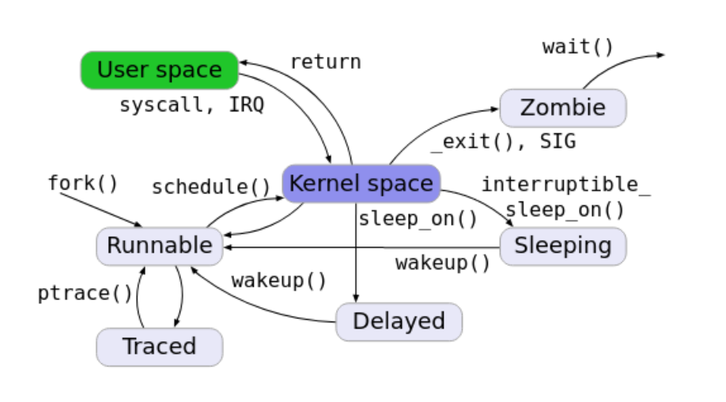
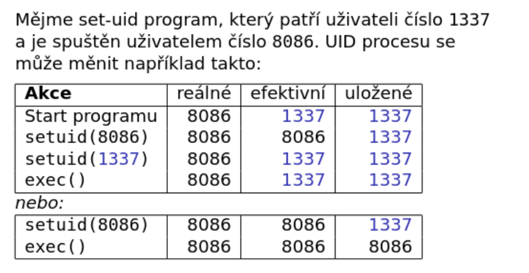
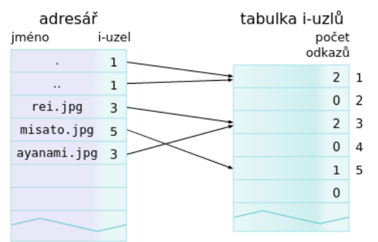

# Operační systémy
Vypracoval @simonf-dev
> Operační systém UNIX, fungování jádra, správa paměti a zařízení jádrem. Základní konfigurace, správa uživatelů, síťové služby. Principy vývoje a vývojové prostředí v UNIXu, práce s procesy, se soubory, vstupní/výstupní operace. Příklady z praxe pro vše výše uvedené

## Operační systém UNIX, fungování jádra, správa paměti a zařízení jádrem
- víceuživatelský, víceúlohový systém, který podporuje příkazový řádek a hierarchický souborový systém
- kernel je základní část systému, stará se o řízení hardwaru, plánování úloh, paměť, procesy atd.
- jádro je načítané při spuštění systému a start se skládá z kroků:
  - identifikují se zařízení jako CPU, disky a spouští se primární zavaděč
  - primární zavaděč je malý program na začátku boot disku
  - poté je spuštěn sekundární zavaděč, ten má načíst jádro
  - nastartuje se jádro, které vytvoří proces 0, inicializuje se periferie, virtuální paměť, CPU, konzole, sběrnice, připojí se kořenového systému souboru a potom se začne inicializovat uživatelský prostor
- jádro je monolitické, takže má většinu svých funkcionalit v jádře, další typy jsou modulární jádro a mikrojádro
- v UNIX systémech je snaha všechno reprezentovat jako soubory (zařízení, sockety, informace o procesech)

### Správa paměti

- paměť spravována pomocí virtuálních adres, ty jsou mapované na fyzické adresy
- každý proces má svou tabulku virtuálních adres, která se používá pro překlad
- paměť jádra je namapovaná do každé tabulky
- většinou víceúrovňová adresace -> první část adresy ukazuje na konkrétní adresu tabulky stránek, další část potom na konkrétní stránku a na konci máme offset ukazující na datový záznam
- **PDBR** je registr, ve kterém má proces uložený první odkaz na stránkování (stránkový adresář), **TLB** cachuje přístupy na virtuální adresu a vrací rovnou přeloženou fyzickou adresu 
- stránky můžou být odstraněny z fyzické adresy na swap místo (disk), systém si to pamatuje (present bit, nebo jinak), zachytí přístup na swapped stránku, načte ji do paměti a pokračuje v běhu
- stejně proces zachycuje přístup na neplatné virtuální adresy, nebo adresy jádra, pokud nemá uživatel přístup
- u liného načítání programu se stránka načte až ve chvíli, kdy ji potřebujeme, vhodné, pokud nechceme přistupovat ke všem datům
- v C jazyku si můžeme alokovat jednotlivé byty pomocí malloc, nebo potom celé stránky vmalloc
- speciální adresy jsou sběrnicové

### Správa zařízení
- zařízení jsou uloženy ve speciálních souborech, dané soubory mají hlavní a vedlejší číslo -> hlavní je číslo ovladače a vedlejší číslo je interní číslo pro ovladač k rozpoznání zařízení
- k zobrazení informací o speciálním souboru můžeme použít **stat**, k vytvoření takového souboru potom **mknod**
- zařízení jsou pojmenovány podle nějakých pravidel, může to být topologie, výrobce, pořadí zapojení, výrobní číslo -> každé z nich má výhody i nevýhody
- pro informace o zařízeních se používá hlavně SysFS, má adresáře podle různých typů pojmenování, poskytuje informace o zařízeních, zpřístupňuje soubory, pomocí kterých můžeme komunikovat s ovladačem
- většinou v adresáři /dev, pro zařízení v uživatelském prostoru potom /udev

## Základní konfigurace a správa uživatelů
- **chmod** poskytuje konfiguraci souborů a to i systémových
- v UNIX existují i startovací skripty **init**,nebo **systemd** -> systemd nabízí víc možností na konfiguraci, logování, init je ve formě klasického shell skriptu
- konfigurace se nachází ve složce **/etc**, jsou tam nastavení pro jednotlivé aplikace, hesla, resolvování hostů atd.
- základní tabulka uživatelů v **/etc/passwd**, je tam jméno uživatele, heslo v zahashované podobě, UID, GID, GECOS, domovský adresář a shell -> **/etc/group** to stejné pro skupiny
- **/var/run/utmp** obsahuje právě přihlášené uživatele
- informace o OS pomocí **uname**
### Instalace
1) spuštění jádra
2) pro instalaci se vytvoří malý souborový systém
3) disk se rozdělí na oblasti a vytvoří se souborové systémy, také se vytvoří swap prostor
4) nakonfiguruje se hardware
5) začnou se instalovat jednotlivé balíčky
6) proběhne postinstalační konfigurace
### Rozložení adresářů
- **/bin** – uživatelské programy potřebné pro jednouživatelský program
- **/boot** –zavaděč systému, může být jako samostatný svazek
- **/dev** – speciální soubory
- **/etc** – konfigurační soubory
- **/lib** – sdílené knihovny
- **/mnt** – dočasně připojované svazky
- **/opt** – velké sw balíky
- **/sbin** – systémové programy
- **/tmp** – dočasné malé soubory
- **/usr** - sdílené soubory uživatelů, také obsahuje podsložky jako bin,lib,sbin
- **/var** - obsahuje soubory, co se mění, jako logy, balíky, soubory které jsou potřeba k běžícím programům atd.
### PAM
- modulární přístup k autentizaci, můžeme si dodělat vlastní autentizaci např. pomocí biometrik, čipových kart, dodat vlastní nastavení
- v souboru pam.conf se definují jednotlivé kroky autentizaci a knihovny, které se mají použít
- fáze autentizace:
  - account - kontrola, jestli má uživatel účet a může přistupovat ke službě
  - auth - samotná fáze autentizace
  - password - změny autentizačních mechanismů
  - session - akce před zpřístupněním služby a po ukončení
- potom definujeme řídící hodnoty:
  - required - jestli selže, selže celá autentizace
  - requisite - selže a skončí hned
  - sufficient - dostačuje pro celou autentizaci
  - optional- nepovinné
## Síťové služby
- **ifconfig** cmd poskytuje informace o síťových rozhraních, můžeme je aktivovat, deaktivovat, nastavovat různé režimy, **route** nám přidá síť k rozhraní
### Sockety
- základní nástroj pro komunikaci po síti, mezi procesy atd.
- je to deskriptor a jeden konec spojení
- má speciální služby jako sendmsg, recvmsg atd.
- při vytváření definujeme doménu (jestli je to síťový socket, lokální UNIX socket atd.), definujeme sémantiku socketu, jestli se komunikuje jako stream dat, nebo přes datagramy atd.
- pro kombinaci domény a sémantiky většinou potom existuje konkrétní protokkol jako IP, ICMP, TCP atd., od systému si můžeme vyžádat tabulku protokolů, které je většinou i v **/etc/protocols**
- sockety také mohou sloužit jako nepojmenovaná roura na komunikaci
- sockety adresujeme podle jejich domény, pro AF_UNIX to je soubor a sémantika (soubory *.sock), pro AF_INET potom ip adresa, port  atd.
- socket vytvoříme a potom mu pomocí funkce **bind** přiřadíme port a adresu na které má naslouchat, pokud se jedná o klientský socket, můžeme mu nastavit i proti adresu - u serverového socketu většinou posloucháme všechnu komunikaci na daném portu
- některé porty mají přiřazený typ komunikace, která by na nich měla probíhat jako 21/tcp je ftp
- důležité operace u socketů jsou např. **listen** (serverový socket poslouchá), potom použije **accept** k přijmutí komunikace a pomocí **fork** vytvoří specifický socket pro danou protistranu, potom to jsou operace jako **recv**, nebo **recvmsg** k přijmutí dat, to stejné se **send** a odesláním
- můžeme definovat různé nastavení komunikace, jako že neblokujeme danou kombinaci IP a portu, tudíž tam může být přiřazen jiný socket, nebo při čtení ze socketu můžeme ponechat ve frontě danou zprávu atd.
### Síťové nastavení a aplikační služby
- pomocí příkazu **route** můžeme měnit směrovací tabulky, přiřazovat rozhraním adresy, kam má jít odchozí komunikace atd.
- příklad **netstat** nám vypíše souhrn otevřených socketů, jejich parametrů, síťových rozhraní atd., pomocí **tcpdump** můžeme odposlouchávat síťovou komunikaci, ale musíme být superuser
- v souboru /etc/resolv.conf jsou obsaženy DNS servery, které jsou použity pro překlad stringových adres na IP adresy -> neplést si s hostname, to je určeno pro lokální síť
- **NFS** je určený ke sdílení souborů po síti, můžeme ho namountovat jako lokální disk, ale má omezení, např. v zamkykání pomocí existencí souboru
- **Port mapper** - takový telefonní seznam pro RPC služby, poskytuje správné přesměrování RPC volání na správné porty, hlavní port je 111 TCP/UDP, ale dané služby můžou běžet někde jinde
## Principy vývoje a vývojové prostředí v UNIXu, práce s procesy, se soubory, vstupní/výstupní operace
- pokud chceme vyvíjet v kompilovaném jazyce a převádět náš kód na strojový kód, tak je třeba nutné použít kompilátor a celý proces se skládá z těchto kroků:
  - preprocesor - odstraní komentáře, rozbalí se makra, podmíněné kompilace - vznikne čistý zdrojový kód
  - kompilace - překládá se do mezikódu, analyzuje se syntax a sémantika, kontroluje chyby a provádí optimalizace, již většinou udělá kód specifický pro procesor/platformu
  - asemblace - převede se na strojový kód, který je spustitelný profcesorem
  - linkování - spojí se s dalšími knihovnami
- program je v paměti rozdělen na zásobník, data, text a haldu
  - v textové části je samotný program + inline proměnné a stringy
  - v datové sekci jsou dvě části - jedna uchovává inicializované globální proměnné, druhá neinicializované (BSS)
  - na haldě jsou alokované stránky, které jsou uloženy ve virtuální paměti
  - zásobník - lokální proměnné, informace o volání a návratu funkcí atd.
- **make** slouží ke kompilaci z více zdrojů, má Makefile, je schopný definovat závislosti, akce atd.
- při kompilaci můžeme dodat přepinače, které nám umožňuji debugování, program je ale pomalejší většinou
### Knihovny
- je to nějaká sada funkcí a proměnných s definovaným rozhraní
- chceme je používat, protože je zbytečné psát stejný kód pro více programů -> není optimalizované
- většina programů linkuje dynamicky, tudíž nemapuje knihovny k sobě do kódu, ale používá jen odkazy do sdílených knihoven v /lib , /usr/lib -> závislost na přítomnosti knihoven
- pokud nalinkujeme staticky, tak do zdrojového kódu našeho programu přidáme všechny potřebné funkce -> není efektivní, ale program je dá se říct nezávislý
- když dynamicky linkujeme v době kompilace, tak má program rychlejší start, ale je těžší zaručit, že je k dispozici správná verze knihovny, nedá už se nic měnit během běhu, problém s verzemi
- formát **ELF** poskytuje křížové odkazy během běhu, můžeme mít více verzí atd.
- C používá hlavičkové soubory, které poskytují interface ke knihovnám
### Procesy

- nějaký běžící program
- má atributy jako stav, program counter (kde se proces nachází v paměti), číslo procesu, rodič, priorita, vlastník atd.
- může se skládat z více vláken, mají stejnou paměť, ale jiný zásobník
- každý proces obsahuje i paměť jádra, přepne se oprávnění a vyvolává se kód v jádru -> oprávnění spravuje samotný kernel
- procesy mezi sebou můžou sdílet paměť, většinou do ní nezapisují, může však sloužit i ke komunikaci mezi procesy
- pokud chci vytvořit potomka procesu, použiju funkci fork -> proces dědí skoro všechno, kromě pid, ppid, zámky na souborech a pár dalších věcí
- při forku se většinou udělá copy-on-write paměť -> procesy sdílí paměť, jakmile chce jeden z nich něco změnit, tak se daná paměť překopíruje -> šetří se místo a je více efektivní
- rodič může potomka monitorovat, nebo čekat na ukončení pomocí **wait**
- **exec** načtu jiný program do současného procesu, nevzniká nový, tudíž se přepíše
- proces má 3 UID - reálné, efektivní a uložené - reálné je ten, kdo spustil proces (může měnit jen root), efektivní většinou stejné jako reálné (když ale spouštím pomocí sudo, tak se změní na superuživatelské) - podle efektivního se kontrolují operace (oprávnění na různé akce atd.), uložené slouží jako záloha, když se manipuluje s efektivním id
- obsahuje i doplňková group ID
- systém si u procesu pamatuje, kolik spotřeboval uživatelského času, systémového času a reálného času, kolik paměti atd. -> dost důležité, pokud děláme monitoring, nebo kvóty pro jednotlivé uživatele, kteří spouští programy
- ty můžeme nastavovat pomocí **setlimit** třeba

- můžeme nastavit prioritu procesu, jen superuživatel může provést negativní změnu (posouvý výš v prioritě)
- procesy můžeme řadit do **skupin**, každý proces může být jen v jedné -> je tam vedoucí skupiny
- skupiny se hodí, pokud přistupujeme k terminálu, nebo chceme zasílat procesům nějaký signál
- procesy se řadí i do **sessions** -> session většinou můžeme přiřadit k terminálu (ale není nutnost), číslo session je číslo vedoucího procesu
- funkce **setsid** odpojí daný proces od sezení a můžeme ho tak odpojit od terminálu -> velmi důležité pro tvorbu daemonů
- sezení většinou končí, když je ukončen leader sezení, odešlou se signály skupinám procesů uvnitř
- jedno sezení může obsahovat více skupin procesů
#### Daemon
- speciální typ procesu běžící na pozadí
- většinou odpojedný od sezení, tudíž může běžet nezávisle na tom, když je sezení ukončeno
- většinou se u nového procesu zavolá setsid (odpojení od sezení), pracovní adresář se změni na / (neblokuje mazaní adresářů), uzavřou se soubory, které má mít rzervované, std. deskriptory přesměrovány do null

### Soubory
- UNIX říká, že skoro vše je soubor
- deskriptor je číslo, který ukazuje na otevřený soubor
- základní deskriptoy 0-STDIN_FILENO, 1-STDOUT_FILENO, 2-STDERR_FILENO - lze je přesměrovat pro daný proces, kam chceme
- různé nastavení u otvírání souboru (append, přepis atd.)
- deskriptory můžeme uzavírat, číst z nich, psát a také posouvat ukazatel po souboru -> příkaz **lseek**
- deskriptory jsou unikátní pro procesy
#### I-node

- struktura která popisuje soubor, uchovává si o něm atributy jako:
  - délka
  - typ
  - UID a GUID
  - přístupy
  - počet odkazů
  - odkaz na datové bloky
- informace o uzlu můžeme dostat pomocí příkazu **stat**
- jsou různé typy souborů, protože jak bylo zmíněno, skoro vše je v UNIX soubor - speciální znakové a blokové soubory, symbolický link, socket, nebo roura
- set-uid a set-gid bity jsou bity, které mi nastaví efektivní id na vlastníka souboru, pokud je spuštěn, sticky bit zase omezuje mazání cízích souborů v adresáři
- nové soubory vznikají podle efektivního id procesu a skupina podle adresáře, nebo procesu
- můžeme definovat masku u tvorby -> vynulují se práva z masky
- právo se většinou značí jako součet 4 - write, 2 - read, 1 - execute
- **chown, chmod** - příkazy na manipulaci s vlastníkem a právy
- jde vytvářet více linků na uzel pomocí **link** - i-node je odstraněn až na něj neexistuje žádný odkaz
- jsou i symbolické linky, ty ale nevytvářejí odkaz
- v /tmp a /var/tmp vytváříme dočasné soubory, které jsou pomocí sticky bitu -> tmp soubory jsou většinou smazány na konci procesu, nebo po nějaké době
#### Adresář
- je to taky soubor
- taky tvořen i-node
- je organizován pomocí pole, stromu - specifické u OS
- má aspoň dva odkazy na sebe a rodiče -> důležité, aby se adresář neztratil v systému
- každý proces má svůj pracovní adresář (tam hledá relativní cesty, pokuď chce číst, nebo vytvářet soubory)
#### ACL (Access control lists)
- umožňuje specifikovat pravidla pro jednotlivé uživatele - nadstavba na klasickým UGO
- obsahuje i pravidla pro dědičnost pravidel - komplexní
- můžou přepisovat, nebo doplňovat klasická UGO pravidla
- vhodné ve složitějších systémech s více uživateli -> můžeme používat i skupiny, ale složitější a větší náchylnost k chybám
- ukázka záznamu: u:bob:rwx,g:wheel:rw-,m::rx
- u vyhodnocování se prvně hledají efektivní UID, GID a doplňkové GID procesu, pokud nenajde, tak vyhodnotí jako o

